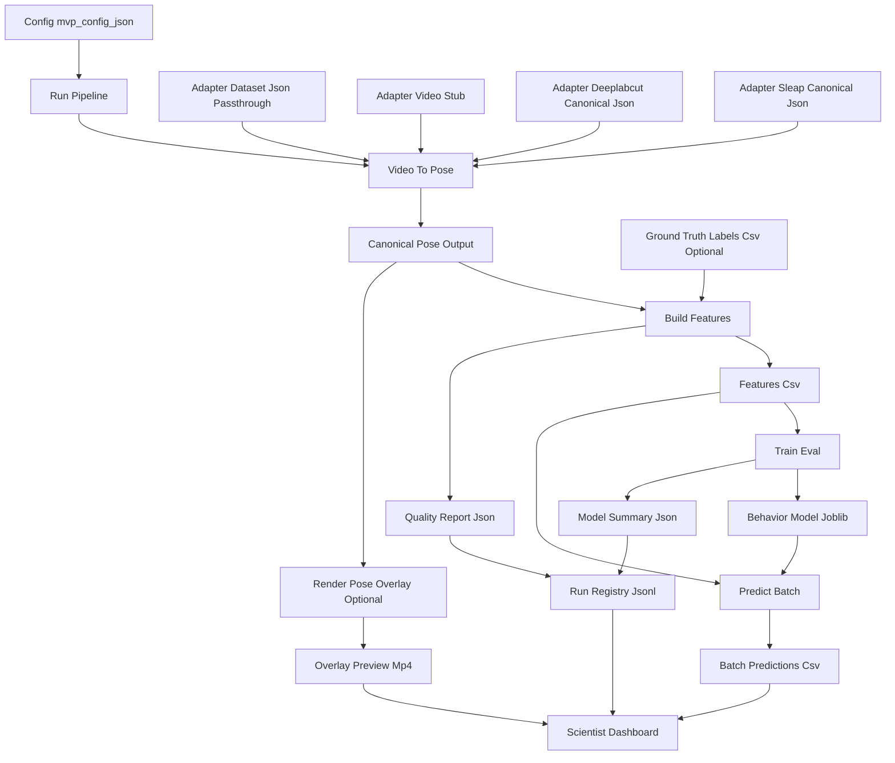

# Mouse Vision MVP System Architecture

## Why this exists

This guide explains:

- how the current system works end-to-end
- how many models are involved and what each does
- what you would do as the person orchestrating this ML system

---

## Naming for clarity (recommended)

Keep file names as-is for engineering stability, but use these clearer names when explaining the system:

| Current component | Clear name for technical walkthroughs | Alias entrypoint |
|---|---|---|
| `video_to_pose.py` | Pose Ingestion and Normalization | `scripts/pose_ingestion_normalization.py` |
| `pose_top_keypoints.json` | Canonical Pose Store | Signals this is the normalized intermediate contract |
| `build_features.py` | Feature and Target Builder | `scripts/feature_target_builder.py` |
| `train_eval.py` | Behavior Model Training and Evaluation | `scripts/behavior_model_train_eval.py` |
| `predict_batch.py` | Batch Scoring Service | `scripts/batch_scoring_service.py` |
| `run_pipeline.py` | Pipeline Orchestrator | `scripts/pipeline_orchestrator.py` |
| `run_registry.jsonl` | Run Lineage Log | Conveys reproducibility and governance |

Use this language in your narrative, while still pointing to the actual files.

---

## Technology stack by architecture layer

| Layer | Main scripts/artifacts | Primary tech |
|---|---|---|
| Orchestration | `scripts/run_pipeline.py`, `launch_mvp.bat` | Python, `runpy`, Windows batch |
| Pose ingestion/normalization | `scripts/video_to_pose.py`, `scripts/pose_adapters.py`, `data/processed/pose_top_keypoints.json` | Python, OpenCV, JSON |
| Feature and target engineering | `scripts/build_features.py`, `data/eda_outputs/features_top_view.csv` | Python, pandas, NumPy-style math |
| Model training/evaluation | `scripts/train_eval.py`, `data/eda_outputs/baseline_model.joblib`, `baseline_model_summary.json` | scikit-learn (LogisticRegression, Pipeline, metrics), joblib |
| Batch inference | `scripts/predict_batch.py`, `data/eda_outputs/batch_predictions.csv` | scikit-learn inference, pandas |
| Visual QA and review | `scripts/render_pose_overlay.py`, `app/scientist_dashboard.py` | OpenCV rendering, Streamlit, matplotlib |
| Lineage and governance | `data/run_registry.jsonl`, quality report json | JSONL audit logging, config-driven reproducibility |

---

## User case flow (research scientist)

### Use case: investigate a potential social interaction episode

1. Scientist triggers the pipeline orchestrator with a pinned config.
2. System ingests pose source and normalizes it to canonical pose records.
3. System computes interaction and movement features per frame.
4. Behavior model scores each frame with `y_proba_close` and `y_pred`.
5. Dashboard groups high-confidence frames into contiguous event segments.
6. Scientist inspects raw frame vs pose overlay around a selected segment.
7. Scientist reviews run lineage (config, mode, metrics, timestamp) before reporting findings.

### What you orchestrate in this flow

- data mode selection and contract validity
- target strategy choice (proxy vs ground truth override)
- metric thresholds for event navigation and triage
- run traceability and artifact reproducibility

---

## 1) Current pipeline at a glance

Current run path:

1. `scripts/pose_ingestion_normalization.py` (alias to `video_to_pose.py`)
2. `scripts/feature_target_builder.py` (alias to `build_features.py`)
3. `scripts/behavior_model_train_eval.py` (alias to `train_eval.py`)
4. `scripts/batch_scoring_service.py` (alias to `predict_batch.py`)
5. `scripts/render_pose_overlay.py` (optional preview artifact)
6. `scripts/pipeline_orchestrator.py` (alias to `run_pipeline.py`) appends run metadata to `data/run_registry.jsonl`

Orchestration entrypoint:

- Preferred: `scripts/pipeline_orchestrator.py --config configs/mvp_config.json`
- Legacy-compatible: `scripts/run_pipeline.py --config configs/mvp_config.json`

Scientist UI:

- `app/scientist_dashboard.py`

## System diagram



Interpretation:

- one orchestrator script runs all stages in a deterministic order
- one trained behavior model is produced per run (logistic regression baseline)
- run outputs and metadata are persisted for auditability and dashboard review

### Diagram (ASCII fallback)

If Mermaid is not rendered in your editor, use this equivalent text diagram:

```text
configs/mvp_config.json
   |
   v
scripts/run_pipeline.py (orchestrator)
   |
   +--> scripts/video_to_pose.py
   |         |
   |         +--> data/processed/pose_top_keypoints.json
   |
   +--> scripts/build_features.py
   |         |
   |         +--> data/eda_outputs/features_top_view.csv
   |         +--> data/eda_outputs/feature_quality_report.json
   |         +--> (optional label override) data/processed/behavior_labels.csv
   |
   +--> scripts/train_eval.py
   |         |
   |         +--> data/eda_outputs/baseline_model.joblib
   |         +--> data/eda_outputs/baseline_model_summary.json
   |
   +--> scripts/predict_batch.py
   |         |
   |         +--> data/eda_outputs/batch_predictions.csv
   |
   +--> scripts/render_pose_overlay.py (optional)
   |         |
   |         +--> data/eda_outputs/pose_overlay_preview.mp4
   |
   +--> append run metadata --> data/run_registry.jsonl

app/scientist_dashboard.py reads:
- batch_predictions.csv
- pose_overlay_preview.mp4
- run_registry.jsonl
- pose_top_keypoints.json
```

---

## 2) Data flow and contracts

### Inputs

Configured in `configs/mvp_config.json`:

- pose source mode (`pose_stage.mode`)
- dataset files (`dataset.*`)
- output locations (`outputs.*`)

Current default mode:

- `pose_stage.mode = dataset_json_passthrough`
- This means canonical pose records are copied from `data/MARS_keypoints_top.json`

Canonical pose output (single normalized interface for downstream steps):

- `data/processed/pose_top_keypoints.json`

### Feature table

`build_features.py` transforms canonical pose records into frame-level features:

- distances (`nose_dist`, `neck_dist`, `tail_dist`)
- body lengths (`b_body_len`, `w_body_len`)
- motion deltas (`b_nose_speed`, `w_nose_speed`, `relative_dist_change`)

Output:

- `data/eda_outputs/features_top_view.csv`

### Labels (target)

Current behavior target column:

- `is_close_interaction`

Target creation behavior in current code:

- default proxy label from nose-distance quantile
- optional ground-truth override from `label_stage.ground_truth_labels_file`
- fallback mode if GT file missing/invalid is recorded in quality report

### Model artifacts

- Trained model: `data/eda_outputs/baseline_model.joblib`
- Metrics summary: `data/eda_outputs/baseline_model_summary.json`
- Batch predictions: `data/eda_outputs/batch_predictions.csv`

### Lineage / run tracking

- Every run appends metadata to `data/run_registry.jsonl`
- Includes pose mode, metrics, data quality stats, artifact paths, timestamp

---

## 3) How many models are there right now?

## In the current default run: 1 trained model

1. **Behavior classifier (trained here)**
   - Type: Logistic Regression (`sklearn` pipeline with scaling)
   - Script: `scripts/train_eval.py`
   - Purpose: predict close-interaction probability from pose-derived features
   - Outputs: `y_pred`, `y_proba_close`

## Optional/External model slots (not trained in this repo by default)

2. **Pose model slot (external, optional)**
   - Enabled via `pose_stage.mode = deeplabcut_canonical_json` or `sleap_canonical_json`
   - Expects externally produced canonical pose JSON
   - This repo consumes those predictions; it does not train DLC/SLEAP in current MVP

2b. **Continuous-video pose runtime integration (external command, optional)**
   - Enabled via `pose_stage.mode = continuous_video_external_inference`
   - `run_pipeline.py` triggers `scripts/run_pose_inference_runtime.py` before normalization
   - External command is configured in `pose_inference_runtime.command` with `{video}` and `{output}` placeholders
   - Enforces contiguous `source_frame_idx` coverage and single-source-video consistency in canonical output

3. **Video stub path (non-research fallback)**
   - `pose_stage.mode = video_stub`
   - Uses heuristic CV + synthetic keypoint layout for local demo/testing only
   - Not a real scientific pose model

---

## 4) What the system currently accomplishes

- Runs reproducible end-to-end behavior analytics from pose records
- Produces interpretable engineered features and baseline classifier metrics
- Writes prediction outputs and run lineage for auditability
- Gives scientist-facing visual QA (raw vs overlay frames, frame scrubber, event segments)

What it does **not** currently do by default:

- run continuous raw-video pose inference with a trained pose network in this repo
- train multi-class behavior endpoints such as attack/mounting from expert labels

---

## 5) Your role as ML system orchestrator (most important)

Think of your job as owning the **system lifecycle**, not just one model file.

## A) Data orchestration

- choose the active data mode (`dataset_json_passthrough`, external DLC/SLEAP, etc.)
- ensure data contracts are valid (schema, missingness, bounds)
- version datasets and maintain reproducible input paths

## B) Label strategy orchestration

- decide which target source is active (proxy vs ground truth)
- validate merge coverage between labels and feature rows
- prevent silent fallback by reviewing quality report fields:
  - `ground_truth_strategy_used`
  - `ground_truth_matches`

## C) Training/evaluation orchestration

- run the pipeline under controlled config versions
- monitor metrics drift across runs (AUC, confusion matrix, class balance)
- guard against leakage and weak split strategy

## D) Inference orchestration

- generate batch predictions on reproducible feature tables
- select operational thresholds and segment logic for downstream review
- verify probability calibration/quality before analyst use

## E) Observability and governance orchestration

- keep `run_registry.jsonl` complete and reviewable
- trace every artifact back to config + dataset version
- maintain a clear statement of model limitations and intended use

---

## 6) Practical architecture mental model for technical walkthroughs

Use this 5-layer framing:

1. **Ingestion layer**: raw inputs + adapter selection
2. **Representation layer**: canonical pose schema (`pose_top_keypoints.json`)
3. **Feature/label layer**: engineered features + target policy
4. **Model layer**: train/eval/infer behavior classifier
5. **Ops layer**: dashboard + run registry + artifact lineage

This framing shows system thinking and MLOps maturity.

---

## 7) Fast walkthrough for stakeholder demos (60–90 seconds)

"Our pipeline is config-driven and reproducible. We normalize any pose source into one canonical schema, engineer interaction and motion features, train a baseline logistic regression for close interaction, and publish predictions plus a full run registry entry. The dashboard supports visual QA at frame level and temporal event-segment review. As orchestrator, I control data mode, target policy, split/eval discipline, and lineage so each run is auditable and comparable." 

---

## 8) Highest-value next upgrades (if asked)

1. Replace proxy labels with expert behavior labels at scale
2. Move from random frame split to session/animal-aware splits
3. Add temporal model features/windows and segment-level metrics
4. Add calibration + threshold governance by research objective
5. Integrate true continuous-video pose inference pipeline (DLC/SLEAP runtime path)
